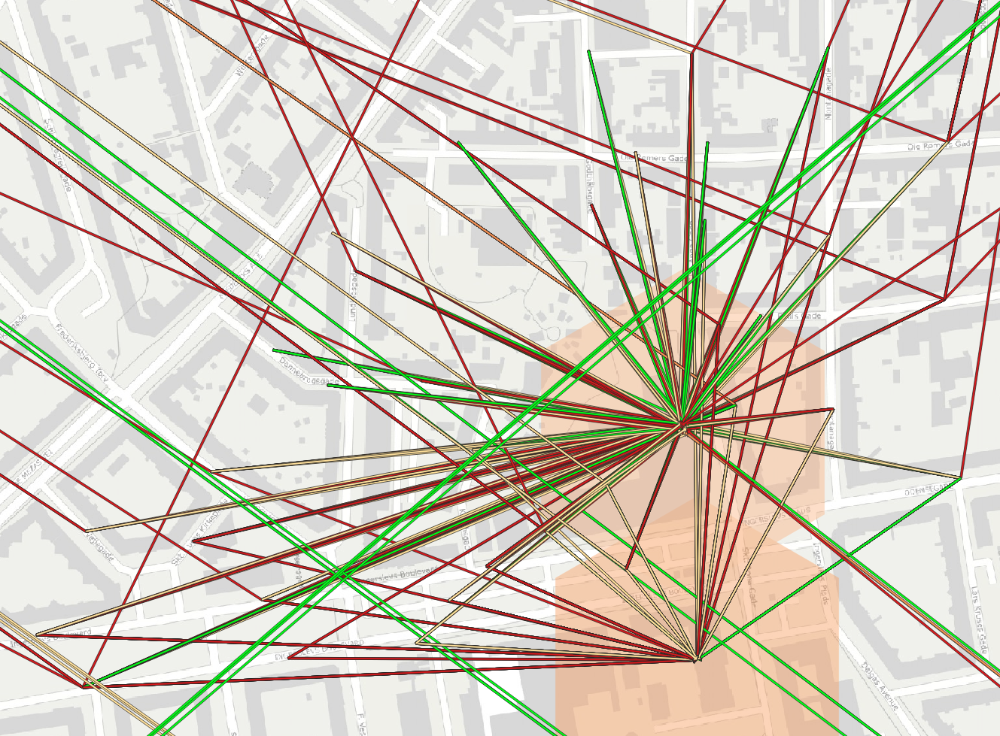

# OS2IoT LoRaWAN signal quality
LoRaWAN signal quality assessment using QGIS for presentation and data from OS2IOT.

Developed by Liban Khalif Mohammed @khalifen in 2024.

## Setup
Set up the `.env`-file based on the example, and run the notebooks `gateways.ipynb` and `iot_devices.ipynb` to generate the CSV files.
You may need to install new python packages by exectuting `pip install pandas` etc. in the terminal.

The notebooks create two CSV with gateways and IOT-devices that illustrate the signal quality.
It can then be visualized as below using QGIS.

Signal quality: Green is good, red is poor.